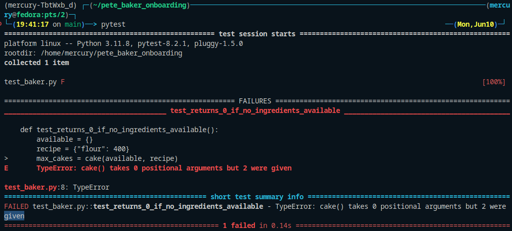

# An introduction to TDD based on the Kata "Pete, the baker"

## 1. The Kata "Pete the Baker"

Pete likes to bake some cakes. He has some recipes and ingredients. Unfortunately he is not good in maths.

Can you help him to find out, how many cakes he could bake considering his recipes?

Write a function cakes(), which takes the recipe (object) and the available ingredients (also an object) and returns the maximum number of cakes Pete can bake (integer).

For simplicity there are no units for the amounts (e.g. 1 lb of flour or 200 g of sugar are simply 1 or 200). Ingredients that are not present in the objects, can be considered as 0.

_Examples:_
- must return 2:
 `cakes({flour: 500, sugar: 200, eggs: 1}, {flour: 1200, sugar: 1200, eggs: 5, milk: 200})` 
- must return 0:
  `cakes({apples: 3, flour: 300, sugar: 150, milk: 100, oil: 100}, {sugar: 500, flour: 2000, milk: 2000})`

Original link [Be careful not to review answers until you’ve completed your answer](https://www.codewars.com/kata/525c65e51bf619685c000059).

## 2. Solving the kata with TDD

### a) Setting up the repository
_The following tasks should be done by only one group member._
- Create a new repository within the organization [TechRisersWomenGroupCodingSessions](https://github.com/TechRisersWomenGroupCodingSessions).
- Clone this repo by running on your local machine by running `git clone <remote-repo-url>`.
- Change the remote repository to your own (instead of the one you cloned) `git remote set-url origin <YOUR_NEW_REPO>`
- Set your own repo as upstream by pushing local content to the new remote `git push -u origin main`.

_Task for the other group members_
- Now the other group members can clone the new repo your created to their local machines.

### b) Setting up the environment
You need Python 3.X and a python package manager. We use _pip_ in this tutorial, but feel free to use your preferred package manager. 
Please check you have python and pip installed as outlined in the [pip documentation](https://pip.pypa.io/en/stable/getting-started/):

Linux & MacOs
```
python --version
python -m pip --version
```

Windows
```
py --version
py -m pip --version
```
Install the dependencies, namely pytest, by running:
```
  pipenv shell
  pip install -r requirements.txt
```
### c) Running pytest and going red

In your terminal, run 
```
pytest
```
. 
Tests should be detected automatically thanks to the naming of the file (e.g. _test_baker.py_) and the naming of the functions (e.g. _test_cake_function_takes_two_args()_) starting with __test__.

You should see one test fail, like so:




### d) Getting started.
Have a look at the material:
- baker.py will contain the production code. Currently, it only contains a function cake() which does not return anything. 
-  test_baker.py contains already a prewritten test.


